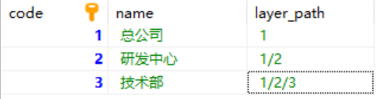
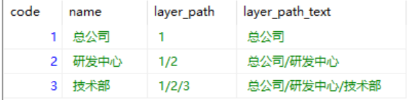

### Mysql查询逗号、'/'分割的id对应的信息

表名：tmp

表结构：

效果：

使用的sql语句：```SELECT t1.code,t1.name,t1.layer_path,GROUP_CONCAT(t2.name order BY t2.code asc SEPARATOR '/') layer_path_text from tmp t1 LEFT JOIN tmp t2 ON FIND_IN_SET(t2.code,replace(t1.layer_path, '/', ','))>0  GROUP BY t1.code ```

参考资料::link:https://blog.csdn.net/weixin_42540974/article/details/106198359