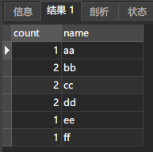

### mysql find_in_set计数

a表

|  id  | b_ids |
| :--: | :---: |
|  1   | 1,2,3 |
|  2   | 2,3,4 |
|  3   | 4,5,6 |

b表

|  id  | name |
| :--: | :--: |
|  1   |  aa  |
|  2   |  bb  |
|  3   |  cc  |
|  4   |  dd  |
|  5   |  ee  |
|  6   |  ff  |

要查询a表中b_ids字段中每个id的name和数量

```sql
select count(*) count,b.name from a,b where find_in_set(b.id,a.b_ids)!=0 group by b.id
```

结果

 
